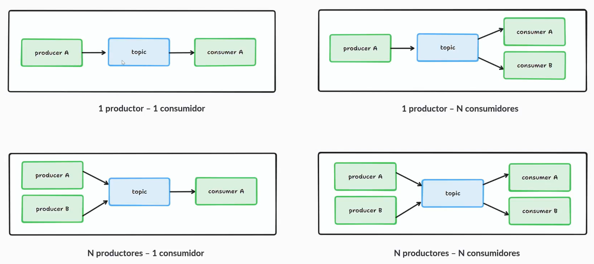
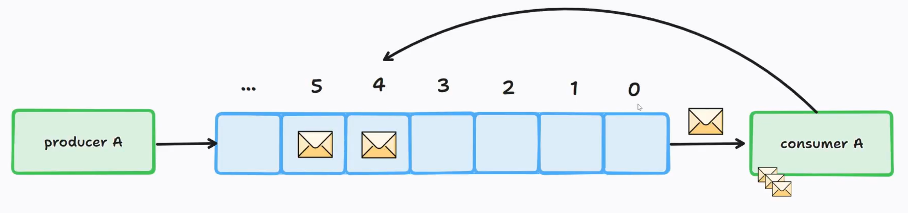
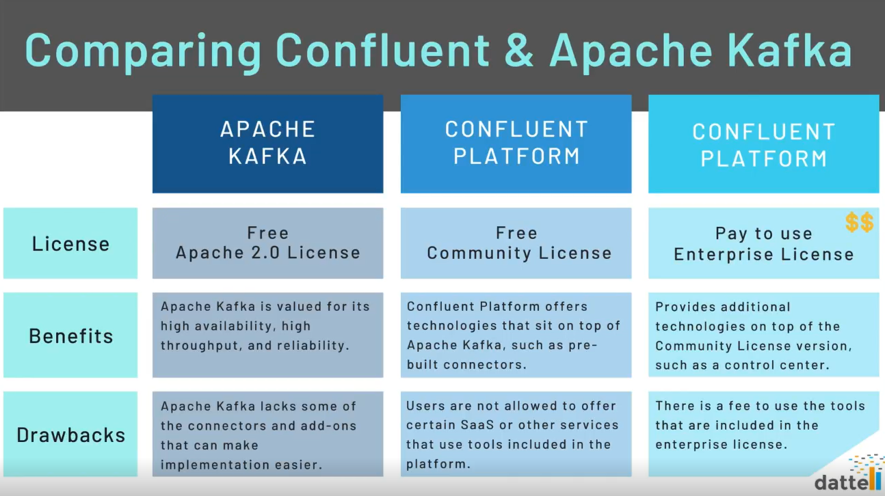
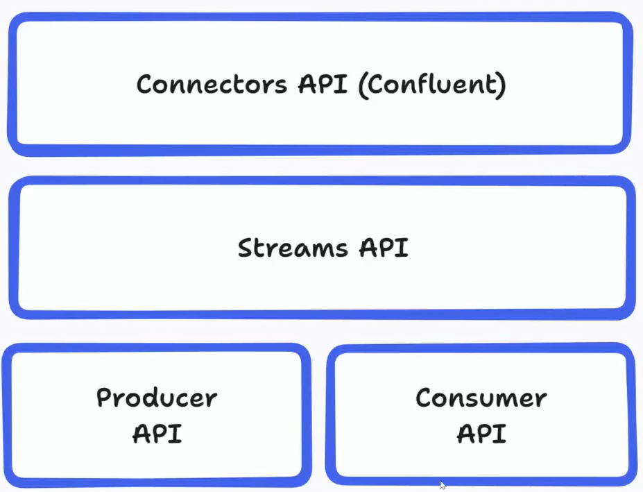
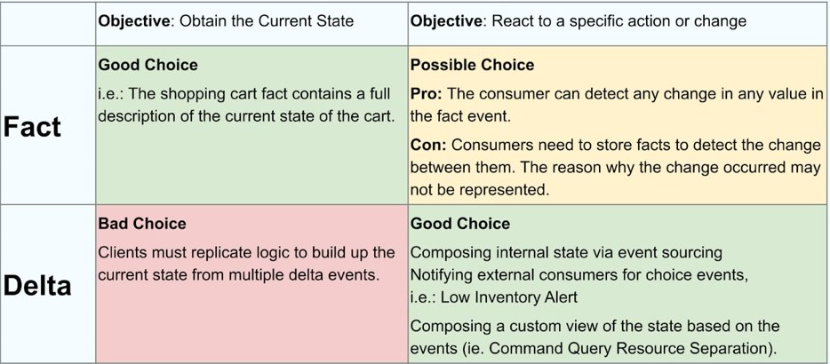
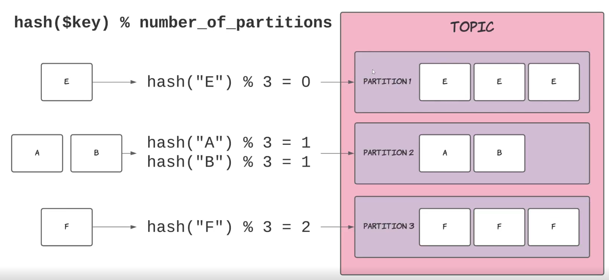
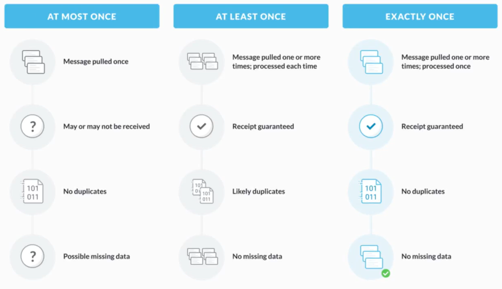

# KAFKA

## 1 - ¿Qué es Kafka?

### Middleware de mensajería

Intermediario entre dos piezas de software que permite el envío
de mensajes o eventos entre ellas.

Basado en el modelo publicación-suscripción.

---

### Tipos de comunicación

Según acoplamiento temporal:

- Síncrona: el emisor espera a que el receptor procese el mensaje.
- Asíncrona: el emisor no espera a que el receptor procese el mensaje.

Según si tenemos que conocer el otro extremo de la comunicacion:

- Unicast(Punto a punto): el emisor conoce el receptor y va dirigido a él.
- Multicast(Publicación-suscripción): el emisor no conoce el receptor,
  multiples receptores.

Kafka permite la comunicación de forma asíncrona.

Cuando un micro publica un mensaje en un topic/cola no sabe
quien lo va a consumir.

Por lo tanto es **asíncrona** y **multicast**.

La comunicacion se realiza de la siguiente forma:

``` Productor <-> Kafka <-> Consumidor```

El productor espera un ACK hasta que Kafka lo confirme.

---

### Topics

Topics = Temas != Tópicos

Es un almacen de datos donde se van escribiendo los mensajes o eventos, relacionados con ese tema.



---

### Mensajes/Eventos

Se publican eventos de dominios por cualquier cambio que pueda interesar al resto de dominios/micros

Ejemplos:

```"Nuevo pedido con rederencia X del producto Y realizado por el usuario Z."```

El productor comienza a escribir los mensajes en el offset 0, debido a que no hay particiones.

El consumidor ha leido los mensajes con los offset 0, 1 y 2, el 3 esta en proceso y el 4 y 5 estan en espera.



Tienen dos partes:

- Key: Identifica el mensaje, pueden haber mensajes con la misma clave. Ej: "user": "albertocanod".

- Value: Campos de la clave. Ej: "city": "almeria".

---

### Clústers de Kafka

Es un sistema distribuido para garantizar la alta disponibilidad.

Se tienen varios brokers montados en un cluster. Los datos estan replicados mediante algoritmos de consenso para garantizar la integridad de los datos ante caída del lider.

---

### Apache Kafka vs Confluent Kafka



[Apache Kafka vs Confluent Kafka: Most Thorough Comparison](https://double.cloud/blog/posts/2023/04/confluent-kafka-vs-apache-kafka/)

---

### APIs

Cuanto más bajo es el nivel, más lineas de código se deben programar.



## 2 - Eventos. Estructura y modelado

### Estructura

#### Headers

Se decodifican antes que el Value, se pueden utilizar para hacer filtrados de forma rápida. Tienen clave y valor.

#### Key

Puede ser cualquier valor que identifique el mensaje.

#### Value

Información que tiene el mensaje.

#### Timestamp

Momento en el que se ha escrito el mensaje en el broker de Kafka.

---

### Modelado tipo **fact**

Envía mensajes con toda la información completa de la entidad.

### Modelado tipo **delta**

Se pasan modificaciones sobre la entidad.

---

### Tipo **fact** vs tipo **delta**



[Fact vs. Delta Event Types](https://developer.confluent.io/courses/event-design/fact-vs-delta-events/)

## 3 - Topics y particiones

### Colas de mensajería

Topics son temas (o colas de mensajería, no garantizan el orden) que almacenan mensajes de un tema en específico.

No son bases de datos:

- No estan pensadas para modificar un registro cualquiera
- Solo tienen la operacion "encolar" y "desencolar".

En los topics no se garantiza el orden de lectura de los mensajes.

---

### Solucion a los problemas de escalabilidad: Las particiones

Los topics estan "partidos", se dividen en "particiones", los mensajes dentro del mismo topic se reparten en las particiones según su key.

Permite escalar horizontalmente los consumidores.

**El orden entre particiones no se garantiza, pero dentro de la misma particion se hace según su offset**

---

### Función hash de distribución

Se hace la funcion hash a la clave, se hace el modulo con el numero de particiones que tengamos y el resultado es a la particion a la que va a ir.

```hash(KEY) % Número de Particiones = Particion resultante```



---

### ¿Duplicidad/pérdida y orden de eventos?

Kafka es un sistema distribuido pero tiene mecanismos para evitar la duplicidad, orden de eventos y pérdidas de datos.

La política más utilizada es la de At least once, en la que podemos tener mensajes duplicados pero no afectará negativamente de forma severa al rendimiento del sistema.



## 4 - Consumer-groups

### ¿Por qué "group"?

Consumer -> Aplicación que lee de un topic de Kafka.

Lo lee a través de un identificador -> Consumer-Group.

Una aplicación puede tener réplicas para que lean del topic en paralelo, permitiendo la escalabilidad horizontal.

Todas las replicas utilizan el mismo identificador de Consumer-Group para no procesar el mensaje dos veces, ni que se pierdan.

Ninguna réplica lee de la misma particion, solo una réplica lee de cada particon. Teniendo un topic de 3 particiones, solo podrá haber 3 réplicas, si hay más estarán paradas.

[Kafka Partitions and Consumer Groups in 6 mins](https://medium.com/javarevisited/kafka-partitions-and-consumer-groups-in-6-mins-9e0e336c6c00)

---

### Rebalanceos y reasignación de particiones

Si una replica cae, se reparte en las particiones de las que leen, el broker espera señales de vida y si no vuelve, se reparte, pese a ser una operacion muy costosa en microservicioes con estado.

**Los rebalanceos solo afectan a los consumidores, son transparentes para los productores.**

---

### Rebobinados

Consiste en que un Consumer-Group reprocese los mensajes desde un punto específico. 

Se le dice al broker que mueva el offset(El punto de procesado actual) de un Consumer-Group.

Casos posibles:

- Al inicio de los tiempos (offset 0 en todas las particiones).
- Al final (offset máximo en todas las particiones).
- Al offset X en una particion en específico.
- A una fecha en especifico

Afectan a un Consumer-Group y a un topic. Ejemplo:

```Si se rebobina a un offset 0 en un <topic, consumer A> no afecta al consumer B. El unico que vuelve a leer todos los mensajes del topic desde el principio es el consumer A.```

#### Motivos para el rebobinado

- Cambio en micro y necesitamos ejecutar la lógica de procesamiento.
- Rellenar estructuras internas de datos tipo StatefulSet(SS).
- Pruebas de rendimiento en entornos NFT(Non functional testing).
- Pérdida de mensajes en producción(Raro que ocurra, segun config del broker).

---

### Lag: Definición, causas e implicaciones

El lag es el número de mensajes pendientes de procesar. El lag se acumula dependiendo del número de topics que tengamos. Ejemplo:

```Tenemos dos colas con 3 mensajes por procesar en cada una.Por lo que el lag es -> 3 + 3 = 6.```

La causa principal es que el consumidor procesa mas lento que la velocidad conjunta de los productores. 

En arquitecturas de tubería se generan cuellos de botella, debido a que en algunos micros se empiezan a acumular mensajes.

En caso realizar un rebobinado puede producirse lag.

El lag es un síntoma malo, y hay que intentar minimizarlo, en los casos en los que los cuellos de botella sean claros.

Implicaciones obvias del lag:

- Tiempos de respuesta en caso de que afecten con los procesos de interacción con el usuario.
- Consistencia eventual (El mensaje tarda en llegar, debido al lag acumulado).

