# KAFKA

## 1 - ¿Qué es Kafka?

### Middleware de mensajería

Intermediario entre dos piezas de software que permite el envío
de mensajes o eventos entre ellas.

Basado en el modelo publicación-suscripción.

---

### Tipos de comunicación

Según acoplamiento temporal:

- Síncrona: el emisor espera a que el receptor procese el mensaje.
- Asíncrona: el emisor no espera a que el receptor procese el mensaje.

Según sí tenemos que conocer el otro extremo de la comunicación:

- Uni-cast(Punto a punto): el emisor conoce el receptor y va dirigido a él.
- Multicast(Publicación-suscripción): el emisor no conoce el receptor,
  multiples receptores.

Kafka permite la comunicación de forma asíncrona.

Cuando un micro publica un mensaje en un topic/cola no sabe
quién lo va a consumir.

Por lo tanto, es **asíncrona** y **multicast**.

La comunicación se realiza de la siguiente forma:

``` Productor <-> Kafka <-> Consumidor```

El productor espera un ACK hasta que Kafka lo confirme.

---

### Topics

Topics = Temas != Tópicos

Es un almacén de datos donde se van escribiendo los mensajes o eventos, relacionados con ese tema.

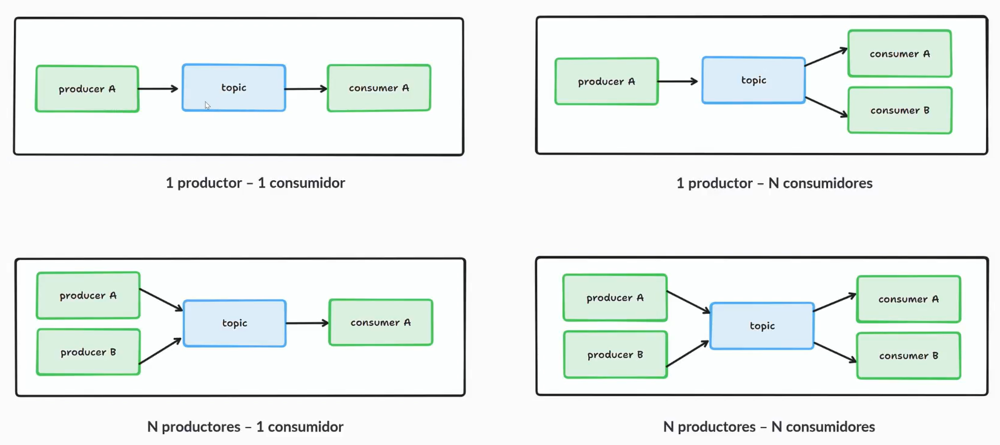

---

### Mensajes/Eventos

Se publican eventos de dominios por cualquier cambio que pueda interesar al resto de dominios/micros

Ejemplos:

```"Nuevo pedido con rederencia X del producto Y realizado por el usuario Z."```

El productor comienza a escribir los mensajes en el offset 0, debido a que no hay particiones.

El consumidor ha leído los mensajes con el offset 0, 1 y 2, el 3 está en proceso y el 4 y 5 están en espera.

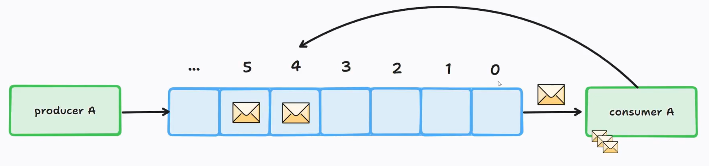

Tienen dos partes:

- Key: Identifica el mensaje, puede haber mensajes con la misma clave. Ejemplo: "user": "albertocanod".

- Value: Campos de la clave. Ejemplo: "city": "almeria".

---

### Clústers de Kafka

Es un sistema distribuido para garantizar la alta disponibilidad.

Se tienen varios brokers montados en un cluster. Los datos están replicados mediante algoritmos de consenso para
garantizar la integridad de los datos ante caída del líder.

---

### Apache Kafka vs Confluent Kafka

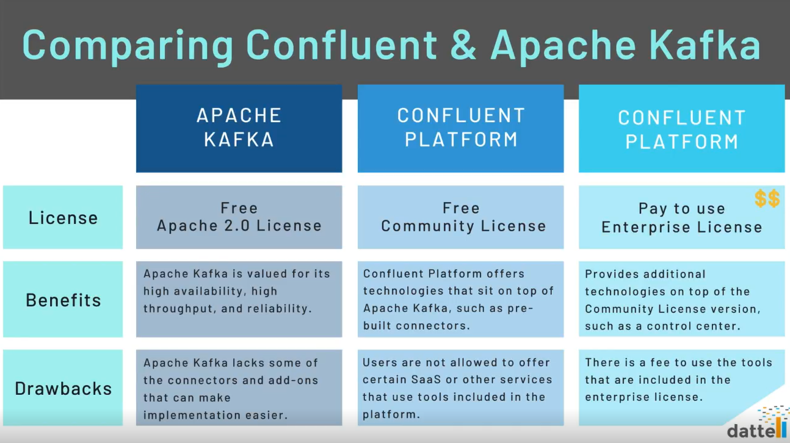

[Apache Kafka vs Confluent Kafka: Most Thorough Comparison](https://double.cloud/blog/posts/2023/04/confluent-kafka-vs-apache-kafka/)

---

### APIs

Cuanto más bajo es el nivel, más líneas de código se deben programar.

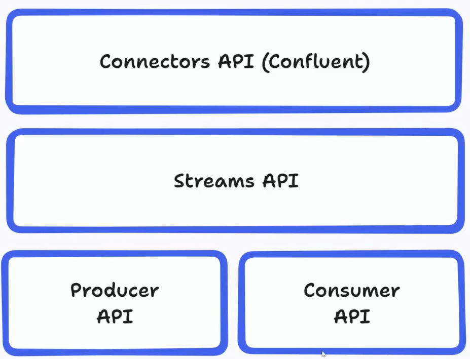

## 2 - Eventos. Estructura y modelado

### Estructura

#### Headers

Se decodifican antes que el Value, se pueden utilizar para hacer filtrados de forma rápida. Tienen clave y valor.

#### Key

Puede ser cualquier valor que identifique el mensaje.

#### Value

Información que tiene el mensaje.

#### Timestamp

Momento en el que se ha escrito el mensaje en el broker de Kafka.

---

### Modelado tipo **fact**

Envía mensajes con toda la información completa de la entidad.

### Modelado tipo **delta**

Se pasan modificaciones sobre la entidad.

---

### Tipo **fact** vs tipo **delta**

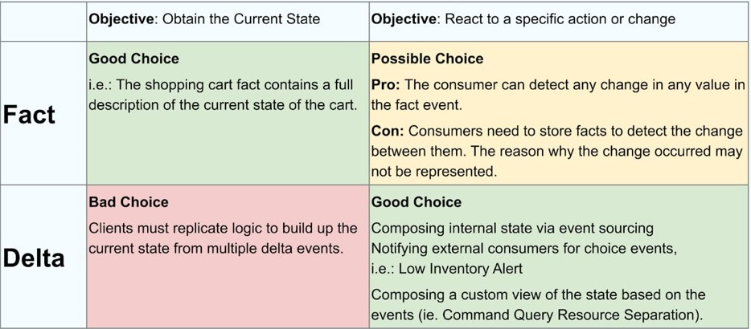

[Fact vs. Delta Event Types](https://developer.confluent.io/courses/event-design/fact-vs-delta-events/)

## 3 - Topics y particiones

### Colas de mensajería

Topics son temas (o colas de mensajería, no garantizan el orden) que almacenan mensajes de un tema en específico.

No son bases de datos:

- No están pensadas para modificar un registro cualquiera
- Solo tienen la operación "encolar" y "desencolar".

En los topics no se garantiza el orden de lectura de los mensajes.

---

### Solución a los problemas de escalabilidad: Las particiones

Los topics están "partidos", se dividen en "particiones", los mensajes dentro del mismo topic se reparten en las
particiones según su key.

Permite escalar horizontalmente los consumidores.

**El orden entre particiones no se garantiza, pero dentro de la misma partición se hace según su offset**

---

### Función hash de distribución

Se hace la función hash a la clave, se hace el módulo con el número de particiones que tengamos y el resultado es a la
partición a la que va a ir.

```hash(KEY) % Número de Particiones = Particion resultante```

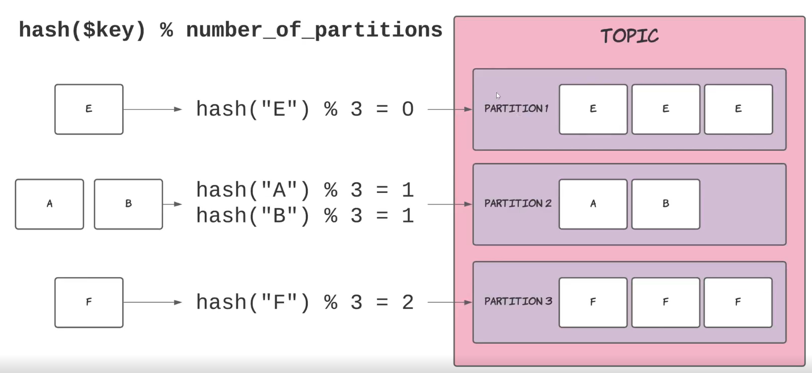

---

### ¿Duplicidad/pérdida y orden de eventos?

Kafka es un sistema distribuido, pero tiene mecanismos para evitar la duplicidad, orden de eventos y pérdidas de datos.

La política más utilizada es la de At least once, en la que podemos tener mensajes duplicados, pero no afectará
negativamente de forma severa al rendimiento del sistema.

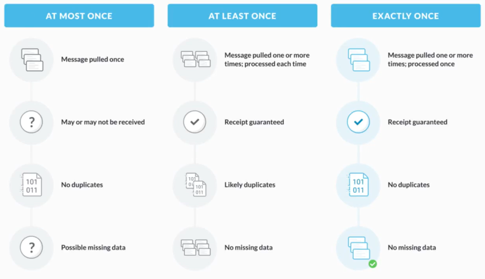

## 4 - Consumer-groups

### ¿Por qué "group"?

Consumer -> Aplicación que lee de un topic de Kafka.

Lo lee a través de un identificador -> Consumer-Group.

Una aplicación puede tener réplicas para que lean del topic en paralelo, permitiendo la escalabilidad horizontal.

Todas las réplicas utilizan el mismo identificador de Consumer-Group para no procesar el mensaje dos veces, ni que se
pierdan.

Ninguna réplica lee de la misma partición, solo una réplica lee de cada partición. Teniendo un topic de 3 particiones,
solo podrá haber 3 réplicas, si hay más estarán paradas.

[Kafka Partitions and Consumer Groups in 6 minutos](https://medium.com/javarevisited/kafka-partitions-and-consumer-groups-in-6-mins-9e0e336c6c00)

---

### Rebalanceos y reasignación de particiones

Si una réplica cae, se reparte en las particiones de las que leen, el broker espera señales de vida y si no vuelve, se
reparte, pese a ser una operación muy costosa en micros con estado.

**Los rebalanceos solo afectan a los consumidores, son transparentes para los productores.**

---

### Rebobinados

Consiste en que un Consumer-Group reprocese los mensajes desde un punto específico.

Se le dice al broker que mueva el offset(El punto de procesado actual) de un Consumer-Group.

Casos posibles:

- Al inicio de los tiempos (offset 0 en todas las particiones).
- Al final (offset máximo en todas las particiones).
- Al offset X en una partición en específico.
- A una fecha en específico

Afectan a un Consumer-Group y a un topic. Ejemplo:

```Si se rebobina a un offset 0 en un <topic, consumer A> no afecta al consumer B. El unico que vuelve a leer todos los mensajes del topic desde el principio es el consumer A.```

#### Motivos para el rebobinado

- Cambio en micro y necesitamos ejecutar la lógica de procesamiento.
- Rellenar estructuras internas de datos tipo StatefulSet(SS).
- Pruebas de rendimiento en entornos NFT(Non functional testing).
- Pérdida de mensajes en producción(Raro que ocurra, según config del broker).

---

### Lag: Definición, causas e implicaciones

El lag es el número de mensajes pendientes de procesar. El lag se acumula dependiendo del número de topics que tengamos.
Ejemplo:

```Tenemos dos colas con 3 mensajes por procesar en cada una.Por lo que el lag es -> 3 + 3 = 6.```

La causa principal es que el consumidor procesa más lento que la velocidad conjunta de los productores.

En arquitecturas de tubería se generan cuellos de botella, debido a que en algunos micros se empiezan a acumular
mensajes.

En caso realizar un rebobinado puede producirse lag.

El lag es un síntoma malo, y hay que intentar minimizarlo, en los casos en los que los cuellos de botella sean claros.

Implicaciones obvias del lag:

- Tiempos de respuesta en caso de que afecten con los procesos de interacción con el usuario.
- Consistencia eventual (El mensaje tarda en llegar, debido al lag acumulado).

---

## 5 - Topics adicionales

### Changelog

Topic especial cuando trabajamos con estados. Se guarda información dentro del propio micros.

El estado se guarda dentro del "pod", pero para tener una copia de seguridad se almacena dentro de Kafka en los topics
changelog.

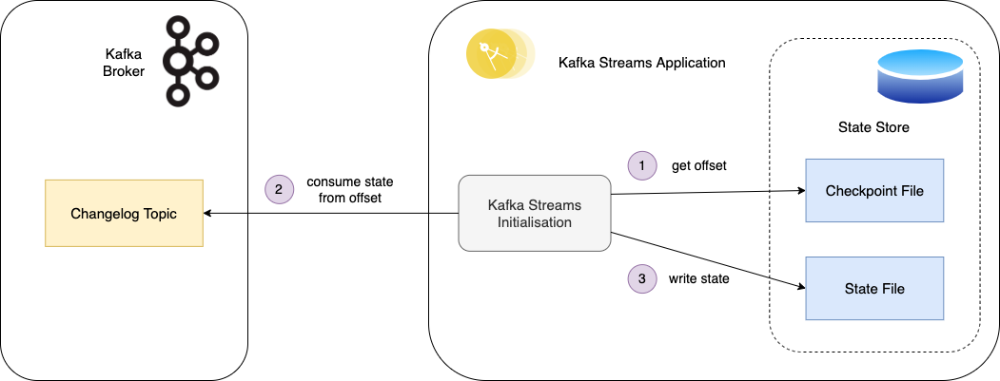

Estos topic tienen tantas particiones como del que aparecen.

Aparecen cuando pasamos de un "flujo/KStream" a una "tabla/KTable".

---

### Repartition

Aparecen cuando hacemos un cambio de clave en los mensajes(modificar, añadir o crear campo).

---

### Iniciales

Los utiliza Kafka para manejar su infraestructura.

#### __consumer_offsets

Guarda para cada Consumer-Group, topic o partición, su offset y cuando ha dicho que está en ese offset.

#### __consumer_timestamps

Lo mismo para sincronización.

#### __schemas

Se verá próximamente

---

### Dead-Letter Queue (DLQ)

Topic donde se escriben mensajes "erróneos", son definidos por el usuario y se deben a excepciones capturadas o que
pueden llevar a excepción.

Ejemplo: Precios negativos.

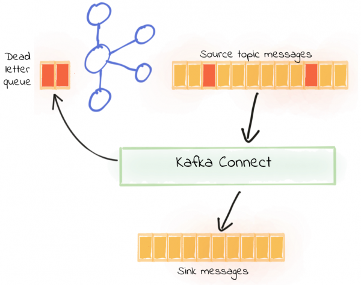

---

## 6 - Topologías comunes

### SOURCE

Transfiere datos de un repostorio (SQL, NoSQL, ...) a un topic de Kafka.

Los micros no tienen estado.

Se utiliza normalmente para hacer migraciones de datos.

Existen conectores para facilitar la
transferencia -> [Kafka Connect.](https://docs.confluent.io/platform/current/connect/index.html)

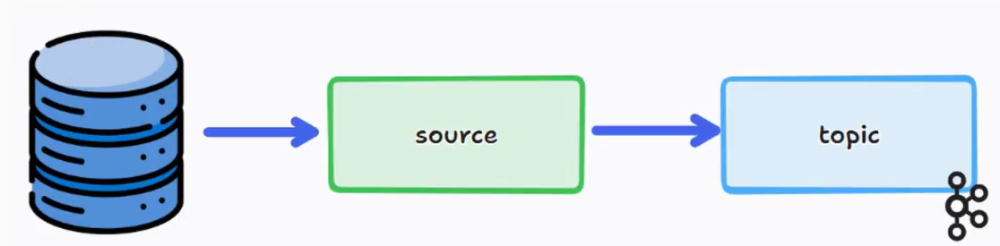

---

### SINK

Transfiere datos de un topic de Kafka a un repostorio (SQL, NoSQL, ...).

Los micros no tienen estado.

Guardamos los datos en una base de datos para que puedan ser consumidos por una API.

Existen conectores para facilitar la
transferencia -> [Kafka Connect.](https://docs.confluent.io/platform/current/connect/index.html)

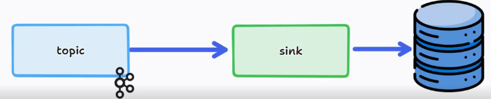

---

### PCS

Lee un mensaje de un topic, realiza operaciones sobre él y lo escribe en otro topic.

Los micros no tienen estado.

Operaciones: Renombrar campos, añadir nuevos con operaciones, ...

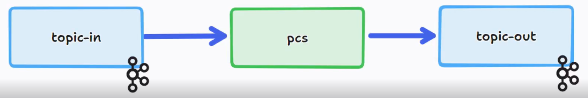

---

### PCSFLM

Lee un mensaje de un topic y escribe N mensajes en otro topic.

Idealmente, los micros no tienen estado.

Normalmente → Saca tantos mensajes como elementos tenga un array de mensajes de entrada(explosionar o flatmappear).

Ejemplo: Usuario compra N productos y en la salida tenemos N mensajes.

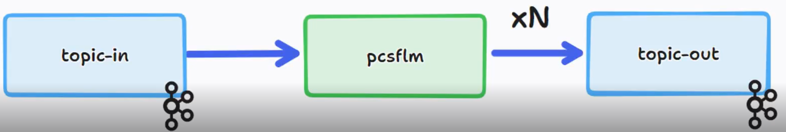

---

### FILTER

Lee un mensaje de un topi y lo escribe en otro si cumple ciertas condiciones.

Los micros no tienen estado.

Normalmente → Deja pasar mensajes con determinado flag.

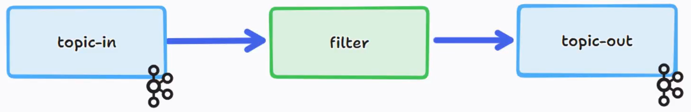

---

### SPL(Splitter)

Lee mensajes de un topic y lo escribe en uno u otro(de forma no exclusiva) dependiendo de ciertas condiciones.

Los micros no tienen estado.

Ejemplo: Dividir productos por número de promociones

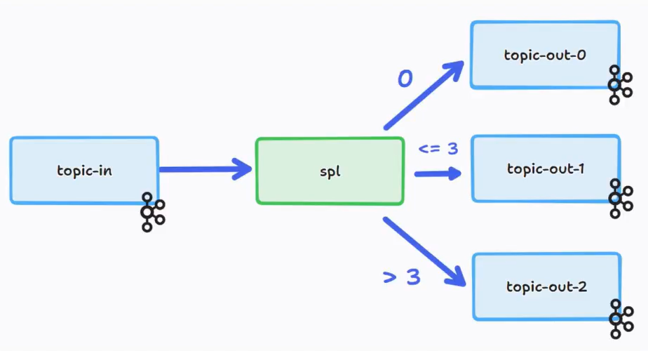

---

### AGR

Lee mensajes de un topic, los agrupa por una condición y escribe en la salida una lista con la agrupación de mensajes.

Los micros tienen estado.

Ejemplo: Recibir <referencia, promoción> en la entrada y escribir <referencia>:<lista de promociones> en la salida.

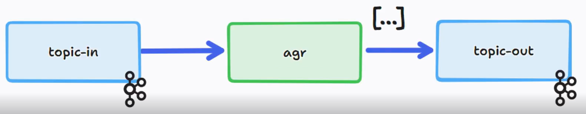

---

### MIXBI

Lee mensajes de dos topics, mezcla la información(join), y escribe un mensaje en el topic de salida.

Los micros tienen estado.

Ejemplo:

- Topic-in-0: "Datos de promoción X"
- Topic-in-1: "A la referencia Y le afecta la promoción X"
- Topic-out: "Datos de la referencia Y junto con los datos de la promoción X"

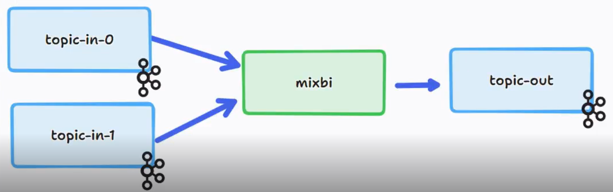

---

### MIXTRI

Lee de tres topics, hace dos join y escribe en el topic de salida.

Los micros tienen estado.

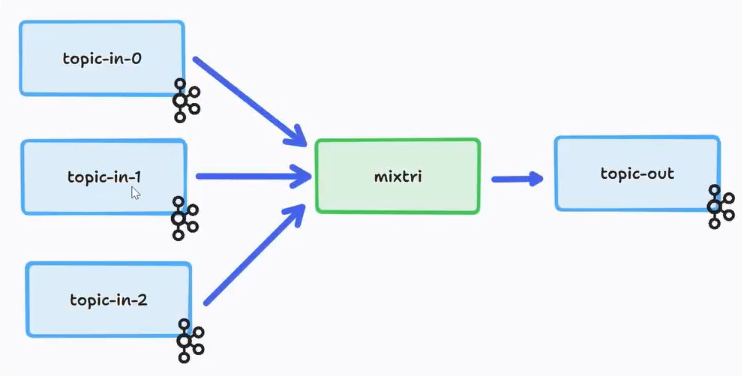

---

### FREE

Topología libre, puede aplicar diferentes lógicas dependiendo de donde se reciba el mensaje.

Los micros pueden tener o no estado.

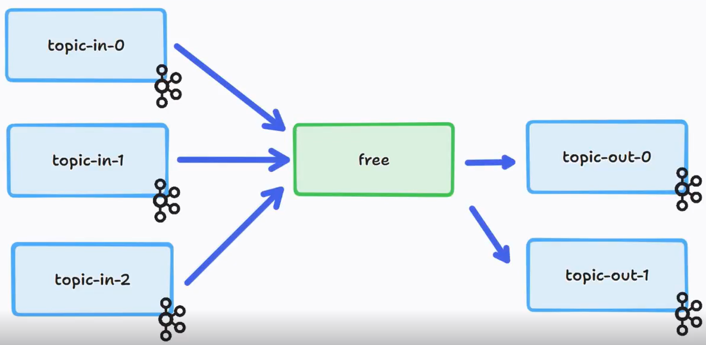

---

## 7 - Como interactuar con Kafka

### Herramientas

### API de productor/consumidor (low-level API)

### API de KStreams (high-level API)

## 8 - Operaciones con KStreams

### peek

### map

### selectKey

### mapValues

### filter

### aggregate

### flatMap

### split

### groupByKey() + reduce() = toTable() (KTable)

### join

### left join

---

## 9 - Serialización y deserialización de eventos con AVRO

La serialización es el proceso de convertir el estado de un objeto en un formato que se pueda almacenar o transportar

### Que es AVRO

- Formato de datos compacto y rápido.
- Independiente del lenguaje de programación.
- Proporciona una biblioteca para serializar y deserializar datos.
- Compatible con sistemas de procesamiento de datos (Hadoop, Spark, Kafka, ...).

---

### Como usarlo

- Añadir dependencia
- Añadir plugin de compilación

---

## 10 - Schema Registry

### Control de contratos (.avsc)

- Representamos los DTO en .avsc para poder reconstruirlos en clases Java, trabajar con ellos, serializarlos o
  deserializarlos en formato AVRO.
- Se pueden hacer a mano o utilizar herramientas ([AVRO SCHEMA TOOLS](http://www.dataedu.ca/avro)).
- Los contratos acaban en el Schema Registry, que se encarga de gestionarlos.
- Si un productor intenta escribir en un topic un AVRO que no cumple el contrato, el Schema Registry lanza
  SerializationException.

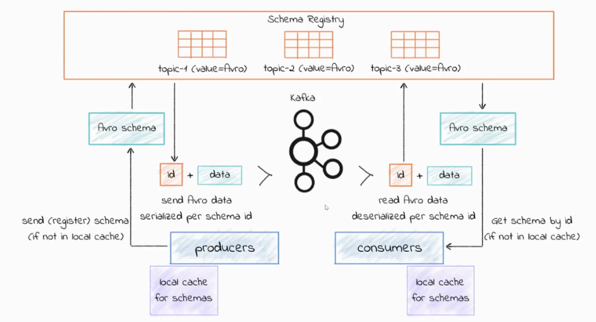

---

### Estrategias de compatibilidad

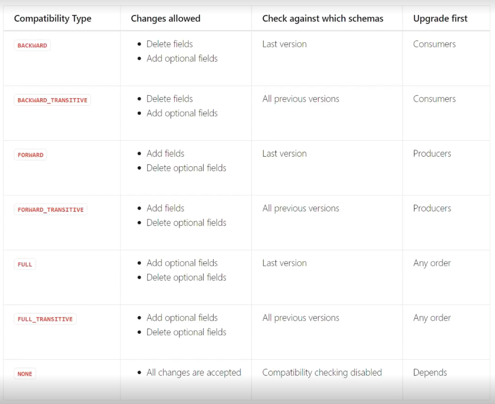

[Más información.](https://docs.confluent.io/platform/current/schema-registry/avro.html#compatibility-types)

---

### Que hacer si tenemos cambios incompatibles

1 - Crear un nuevo topic con el nuevo contrato y consumirlo con un nuevo consumidor(más laboriosa y limpia).

2 - Purgar el topic y borrar los esquemas(más rápida y sucia).

---

## 11 - Políticas de limpieza de topics

### El problema de almacenamiento

- Sin limpieza, los topics crecen indefinidamente.
- Los mensajes se almacenan en disco, por lo que es caro mantenerlos.
- Si no se borran o compactan, las búsquedas son muy costosas.

---

### Políticas de limpieza en detalle

- Existen políticas de retención de mensajes:
    - Por tiempo(retention.ms): Los mensajes se borran cuando pasa X tiempo(1 día, 1 minuto, ...).
    - Por tamaño(retention.bytes): Se guarda hasta alcanzar un tamaño establecido(1 GB, 1TB, ...).

- Estas configuraciones van de la mano de una política enfocada al borrado, cleanup.policy = delete.
- En cuanto se cumple una de las dos condiciones, se borran los mensajes.
-

---


